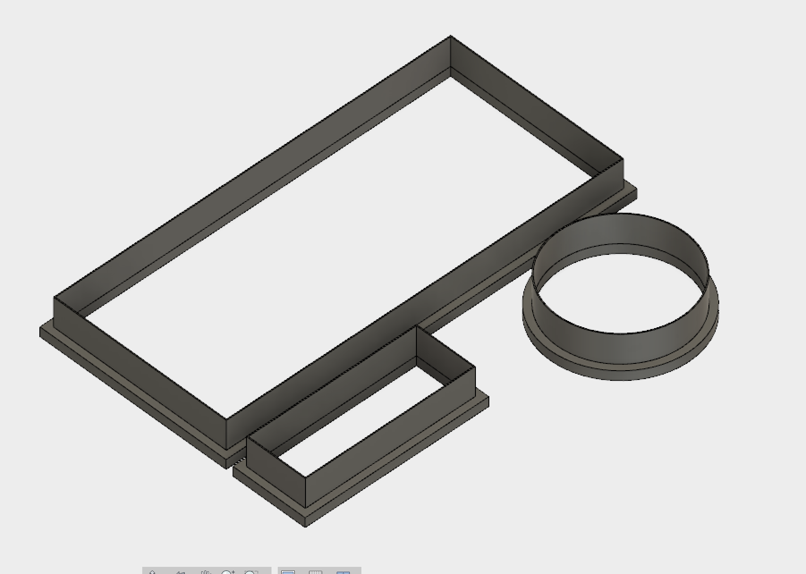
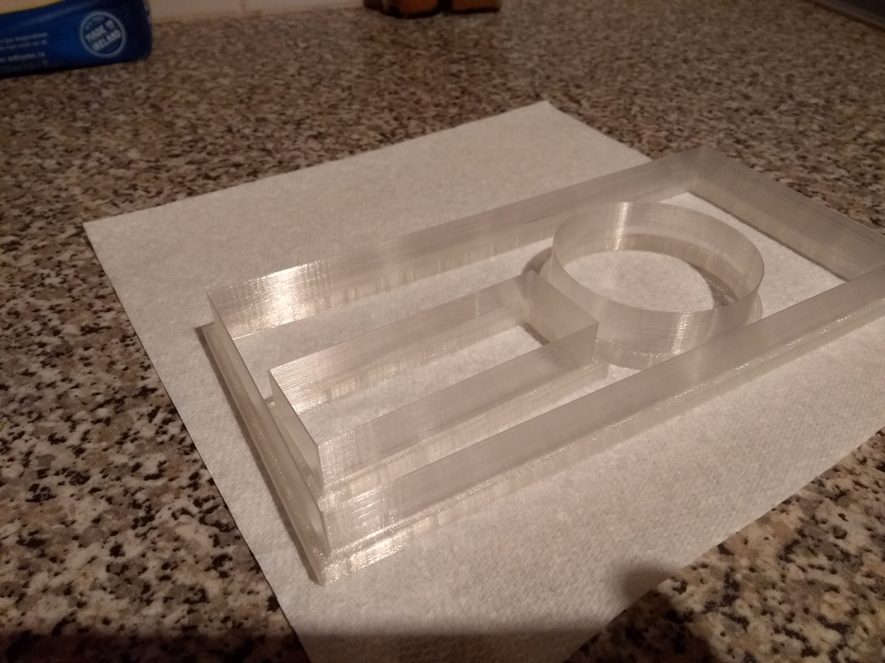
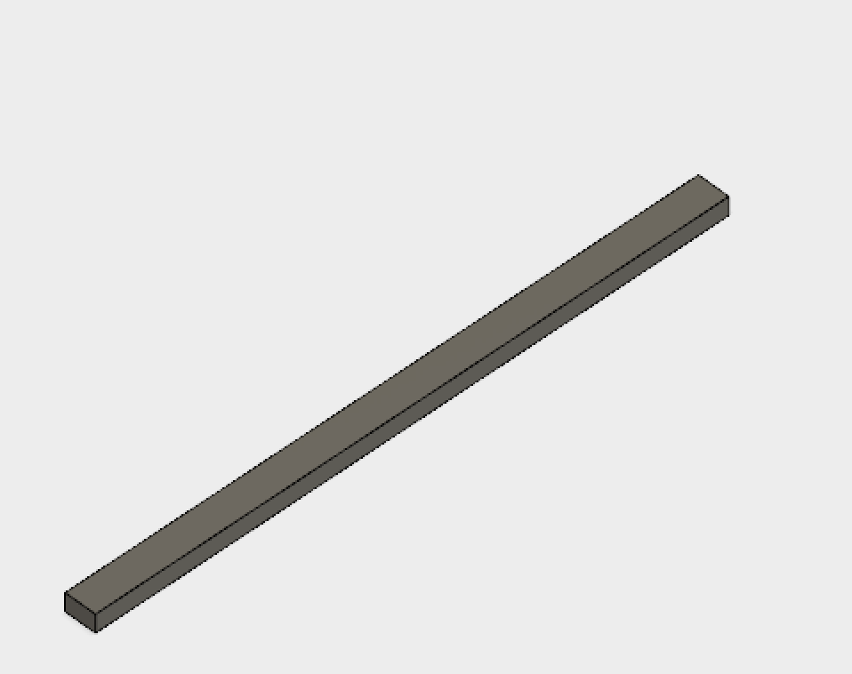
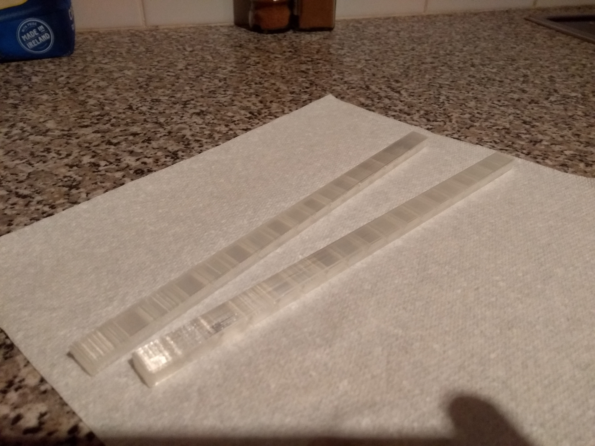
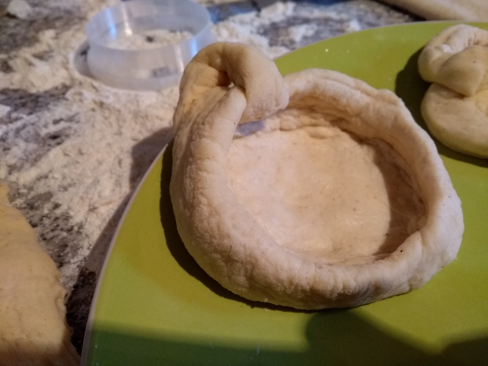
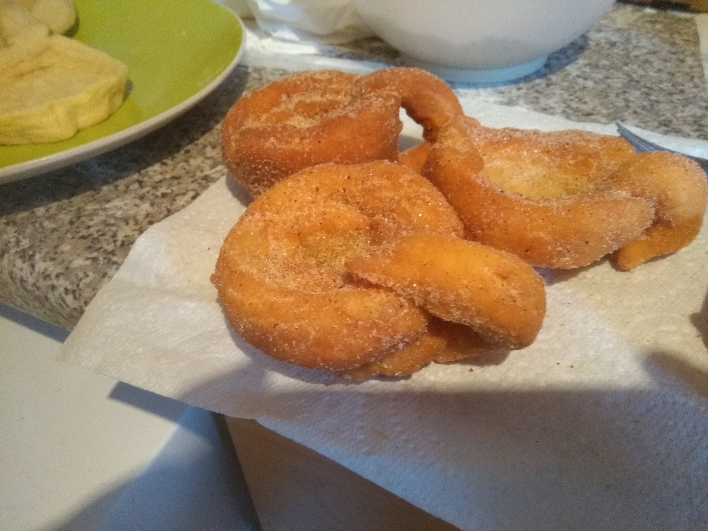
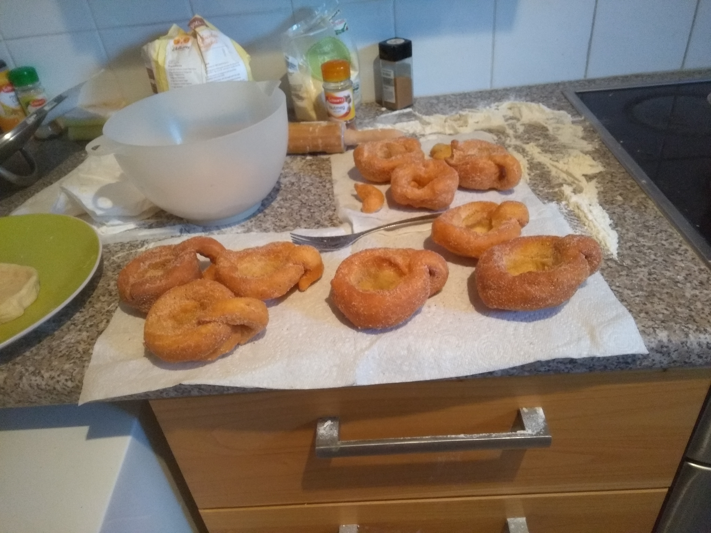

# Topological Donut

(From: https://en.wikipedia.org/wiki/Homeomorphism)

The aim of the project is to be able to design a system to fry or bake [homeomorphisms](https://en.wikipedia.org/wiki/Homeomorphism) of the [torus](https://en.wikipedia.org/wiki/Torus), known by physicists as 'donuts'. Specifically, the first target is to
be able to bake a cup of tea/coffee using donut ingredients in such a way one can drink the tea/coffee and simultaneously eat
the donut.

It's **earth friendly** as there is no disposal
of cups. You eat them and they taste better  because of the traces of coffee/tea.

# 3D Modelling
The project consists of four types of 3d-printed tools:
- Moulds
   - Circular cup base
   - Wall cup
   - Handler
   
   
 - Bar slider for rolling pin to ensure the wanted 6mm thickness of the dough
 
 

# Recipe
Once the dough is at most 6mm thick, cut the circular base with the 3d-printed mould.

Next step is to cut the wall of the cup.
With the mould you will be able to get 3 walls. Thus you have to then use again the mould to reduce them to a third.

Then you should use the handler mould. With it you will be able to get two handlers and thus you should reuse the mould to split them into two.

Finally you should press the base in such a way the circle gets around 20% bigger and at the same time making sure the base and the handler are properly attached together as otherwise they will tear apart during frying.
Walls should be folded around the circular base to make sure they stick to it. You should not try to make walls taller, rather shorter and surrounding the circular base.

The result should be similar to:

Finally you should fry it. The best is start with the convex/internal part of the cup touching the oil. This way you will make sure the pressure from the oil keeps the convex shape and you can still put some coffee/tea. I made the mistake to do it the other way around and for quite a few cups, there is no much space for tea/coffee :(

The final result should be similar to:

And all together:

